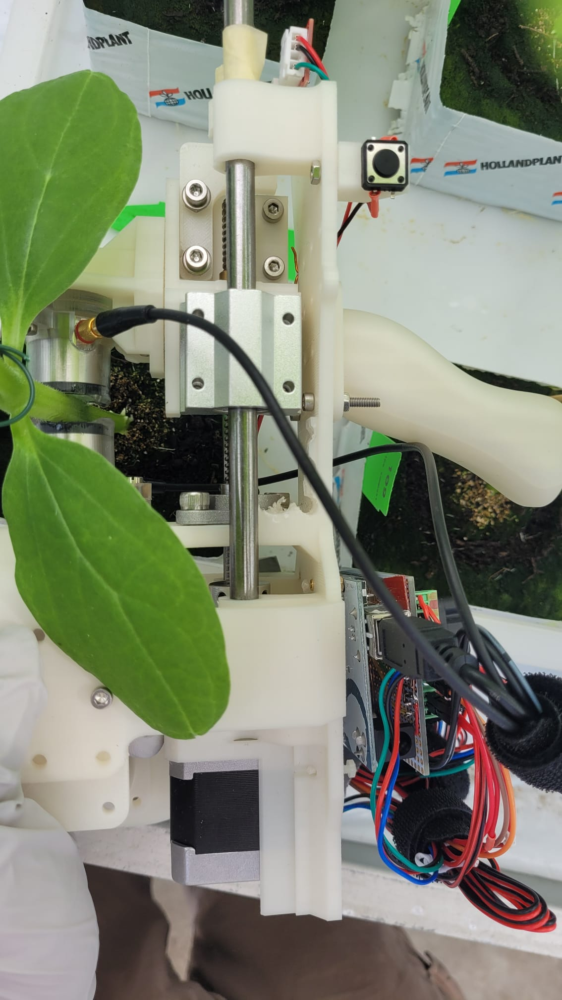
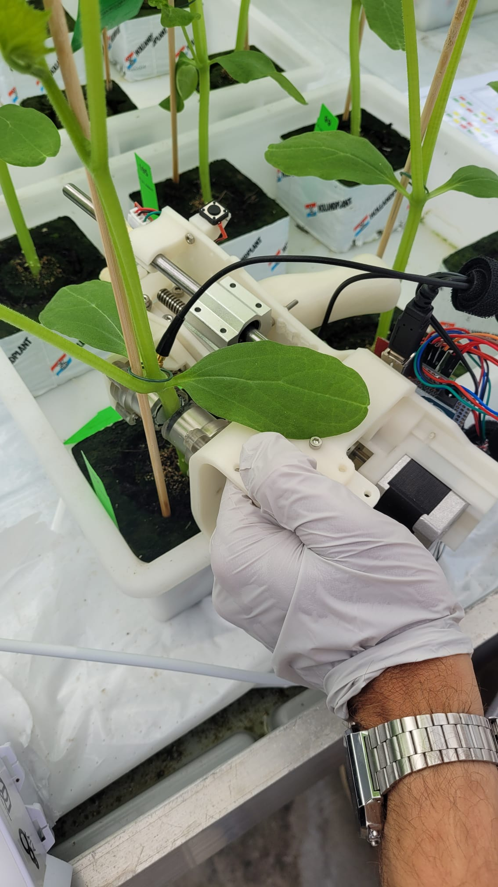
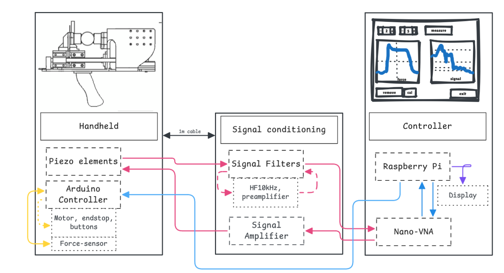

# plensetechdoc-handheld
Documentation and code for the ultrasound handheld measuring device built by plense-technologies.

## Overview

A precision-engineered handheld setup for in-situ acoustic measurement of plant stems. The system integrates a force-controlled stepper motor clamp, dual piezoelectric transducers, and a Raspberry Pi GUI. Measurements are triggered by controlled force application and executed via a miniVNA, producing calibrated Touchstone files for further analysis.

## Features

- Arduino-based motor and endstop control
- Force sensor for precise clamping
- Dual piezo transducers for signal transmission/reception
- Signal conditioning hardware
- miniVNA for impedance/transfer measurements
- Raspberry Pi GUI for system control and data capture

---

## Repository Structure

```text
handheld-acoustic-device/
│
├── README.md                   # Top-level documentation overview
│
├── arduino-firmware/           # Firmware for stepper motor and sensor control
│   └── clamp_control.ino
│
├── raspberry-pi-gui/           # Python GUI application for Raspberry Pi
│   ├── README.md               # Installation instructions and user guide
│   ├── requirements.txt        # Python dependencies (pip)
│   ├── calibration/            # Calibration files for nanoVNA
│   │   └── calibration_10-500khz.cal
│   ├── code/                   # GUI and controller source code
│   │   └── *.py
│   └── output/                 # Output folder for measurement results
│       └── metadata.json       # JSON file storing configuration and metadata
│
└── hardware/
    ├── schematics/             # Circuit diagrams and signal conditioning chain
    │   ├── signal_conditioning_chain.pdf
    │   └── arduino_schematics.pdf
    ├── bill_of_materials.md    # Parts list (can also be .xlsx)
    ├── cad/                    # Fusion 360 design files
    │   └── ...
    └── stl/                    # 3D printable models
        └── ...


```
<p float="left">
  
  
</p>

---

## 1. **Introduction**
Welcome to the startup guide for using our handheld plant acoustic sensing system. This document provides an overview of system components, setup procedures, operating routines, and background theory. This device and its applicability and methodology are developed by plense technologies in 2023-2025. The goal of this device is to measure accoustics through the stem of a plant and part of a sensor development project. 

The produced data from this setup can be analyzed using the [developed data-tools in this](https://github.com/StijnSlebos/plensetechdoc-dataanalysis) repository.
Our other related projects for [passive audio capture](https://github.com/StijnSlebos/plensetechdoc-passiveaudiocapture) and for the [plensor multisensor system](https://github.com/StijnSlebos/plensetechdoc-sensoredgecode) can be found in their respective repositories.

For any questions related to this project please reach into the discussiong tab (and perhaps your question is already answered there!).

Below you will walk through the system description, the setup-guide, a walkthrough of usage, a startup explanation of the data-analysis with touchstone files and lastly a troubleshooting guide. The subsections below will cover theoretical background and goals. 

### 1.1 **How It Works: Ultrasound sensing**
The system analyzes the frequency-dependent transmission characteristics of acoustic signals through the plant stem, reflecting physiological and structural traits. The stem is clamped and probed using piezo transducers, while signal analysis is conducted via the nanoVNA. Coordination is handled by the Raspberry Pi and Arduino.

### 1.2 **Theoretical Background: why would you sense ultrasound in a plant**
#### Acoustic Impedance and Frequency Transmission
- Frequency-dependent impedance and transfer response represent internal mechanical structure
- Influenced by stem stiffness, geometry, water content, and health status

#### Plant Sensing Rationale
- Transfer functions provide insights into physiological condition
- Non-destructive and consistent over time


## 2. **System Components**
_images speak louder than words_


- Arduino-based motor and endstop control
- Force sensor for precise clamping
- Dual piezo transducers for signal transmission/reception
- Signal conditioning hardware
- nanoVNA for impedance and frequency response measurement
- Raspberry Pi GUI for system control and data capture

You might want to bring with you when going into a greenhouse for testing:
- Caliper (schuifmaat)
- Smartphone for photo documentation
- Notebook

## 3. **Setup Instructions**
If you work with an existing setup, you can skip the first segment where the construction and configuration is explained. However, it might still be good to understand the entire setup in case of troubleshooting. The arduino firmware upload is only necessary once per arduino. (an arduino is a microcontroller, it will just do whatever you configure it to on startup -> setup 🎚️ once and then loop ♻️.)

---
### Building the setup
-> see the [assembly documentation](hardware/hardware_assembly.md), BOM and cad files in this repo.
_it is all explained there!_

---
### Arduino Firmware 

> ⚠️ **Warning**: If homing does not occur immediately or endstop trigger fails, disconnect power to avoid mechanical damage.

Firmware upload is only necessary when building a new system.

For **new setups**:
- Connect the Arduino via USB to your computer or Raspberry Pi
- Use the Arduino IDE or run:  
  `arduino-cli upload -p /dev/ttyUSB0 --fqbn arduino:avr:uno clamp_control.ino`  
  (adjust port and board as needed)
- Ensure the correct board and port are selected
- After upload, if necessary reset the Arduino or power-cycle to trigger homing (generally after upload it triggers a reset; opening a serial monitor also triggers reset)

For **existing setups**:
- Ensure power is connected to both Arduino and the motor driver (black adapter)
- On power-up, the Arduino will automatically home and enter wait mode

---
### Standalone Arduino Operation (Serial Monitor)

The Arduino firmware (`clamp_control.ino`) can also operate without the GUI, using direct commands via a serial monitor.

To trigger a force-controlled clamp cycle, send the following command over the serial interface:

```bash
MOVETOFORCE <force_in_N> <hold_duration_in_s>
```

**Example**:
```bash
MOVETOFORCE 12 5
```

This moves the clamp to **12 N**, holds for **5 seconds**, then automatically returns to home position.

> ⚠️ **Force Limit**: Never exceed `15 N` to avoid damaging the clamp or sensor.

---
### Raspberry Pi GUI Setup

For the full explanation of the RaspberryPi controller/gui code, I refer to the dedicated [README.md](raspberry-pi-gui/README.md) within its folder.

Quick Startup sequence (from code-terminal or other terminal environment):
```bash
cd contact-edge-code
source venv/bin/activate
python gui.py
```

_Notes:_
- GUI may stall on message boxes — check active windows.
- The nanoVNA **does not require manual calibration**: calibration files are loaded automatically from the Raspberry Pi.
- However, the mechanical setup **must be calibrated on startup** using a 12 mm stave to align motor steps with diameter.
- Use "Single" measurement mode (~~3 repetitions does not function reliably~~).
- GUI failure mode is non-destructive; no need to delete files after crash.
      - See troubleshooting at the end of file for common errors

## 4. **Usage Workflow**
Once you have everything set up hardware wise, make sure the raspberry pi software (os and then python gui) is also ready to run. When you have the full setup ready, follow the following steps to perform a full measurement/experiment.

- Start by configuring the settings in the metadata file. This is used as settings for your experiments and makes sure all filenames and data is in proper format
- Also make sure you have some data-storage-space available. (the file sizes are not very big, but no space could cause errors)
- Once thats all set up, connect the power to the arduino (first the usb/5v to the Raspberry pi, then once that works, the 12v to the motor)
     - if homing occurs properly you can continue
- Now we can start the gui application from the raspberry pi (its above)
     - And perform the required calibration run with a 12mm stave.

Once this is all set, below the workflows for different situations.

### Clamping Routine
Once you are all set, you can:
- Position stem in clamp; this will be a bit nifty at first, but make sure everything is well in place once you press measure
- configure plant and/or node number in the GUI
- press measure or 3 reps
- hold still during the measurement
     - this will be the hard part, but this makes for better results
- Wait for automatic homing
     - the force measurement is now also finished, you can move freely again

**Per Plant Protocol:**
Some remarks on working with plants:
- Label plants if not already labeled
     - nodes might also need labeling if you measure multiple (generally greenhouses/experimental facilities have tools for this)
- Measure stem/node diameter using caliper
- Take a photo of the plant using a smartphone
- Write down specific observations (after 10 plants many things will be forgotten)

**Triggering nanoVNA**
THe nanovna is controlled through the gui, so you wont have to do anything specifically yourself:
- Use GUI to start frequency response measurement
- Ensure mechanical calibration has been completed
- If the vna does not respond properly reset or restart it

> When running in new settings, it is advised to recalibrate and update the calibration file accordingly.

**Data Retrieval**
- Measurements saved locally on Raspberry Pi
- Access via SCP or USB expor
     - _Raspberry Pi Connect_ is a nice new service worth checking out for these purposes. 

## 5. **Data Format**
The frequencyresponse (vna transfer data) files are saved in touchstone files. The force data is logged to a csv-file. The metadata(.json)file can be loaded or read to match files with measurements. 

### Metadata.json
Metadatafile in proper json format. Can be loaded in python as a dictionary containing both settings and measurement logs.

### Touchstone (.s2p)
- Standard 2-port network parameter file
- Contains frequency, magnitude, and phase of S11/S21 etc.
- Can be visualized with tools like NanoVNA Saver or MATLAB

### Force-sweep (.csv)
- Standard csv log,
- contains timestamp, microsteps (travel), distance (converted from travel) and force in newtons (N).

## 6. **Troubleshooting Guide**
### Common Problems & Tips
- Start measurements at 8:00 — helps reduce heat and avoids interference with irrigation (sproeiers)
- Time might be inaccurate if there’s no internet connection
- Use a comfortable amount of ultrasound gel — not too much, not too little
- Always calibrate using the 12 mm stave — either one is acceptable
- Calibrate hourly unless failure mode disrupts the flow, in which case recalibration might not be required
- Use keyboard and mouse due to gloves (touchscreen is unreliable)
- **Remove the dripper before starting measurements**
- Manually measured diameters are preferred — the values in `metadata.json` are unreliable

### Failure Modes
- Stop immediately if a measurement takes unusually long

### Full Restart Procedure
1. Unplug Arduino cable (on the Arduino side)
2. Exit the GUI
3. Power cycle the nanoVNA using its slider switch
4. Open Arduino IDE and check the port number:
   - Program: Arduino, under Programming
   - Tools → Port: identify the correct `/dev/ttyACM*` port
5. If needed, update the port in `motor_test.py` to match
6. Reconnect the Arduino USB cable
7. Restart the GUI and perform calibration

## 7. **Contributing & License**
- WUR and TUD Proposals
    - Proposals

- Open contributions welcome.

- Licensing details in the licence file.


