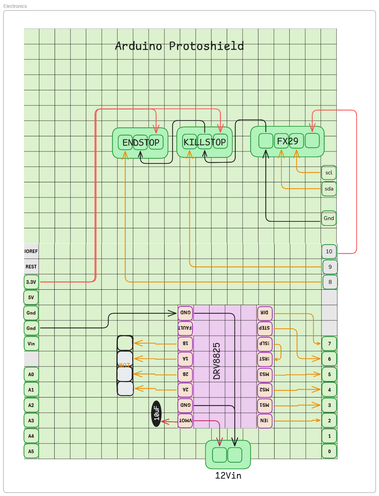
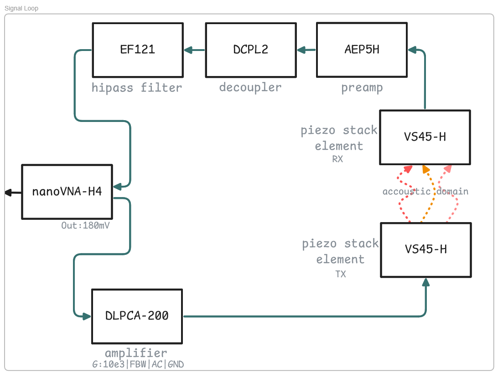

## **Hardware Assembly**
TO build the entire handheld device with controller make sure you have to following at hand:
- 3D printer (FDM)
- 3D Resin printer (not strictly necessary, for accoustic decoupling of piezo elements)
- Solder station + materials like wires, solder, connectors, etc.
- PC & Internet Connection: to flash your RPI sd-card and pull the code
- Preferably a way to interact with the fusion (.f3x) assembly file (can be done online)
- All Components on the [Bill-of-materials](bill-of-material.md)

---
### **3D printed parts**
Preferably print all the parts in the FMD tab of the BOM with a strong material like abs/asa on high infill (100%). THis is not required, per strict, PLA and lower infills down to 15% should also work.

For the resin printed parts, in our assembly we have constructed them from Elastic50A resin with a formlabs 3 printer. An elastic TPU might also work with FDM. The printed parts are quite small, it might be worth looking online to order at an on demand printfarm if you do not have access to a (resin) printer

---
### **Assembly of handheld**

For assembling the handheld, the easiest way would be to open the assembly from the fusion file. This way, the goal configuration is known to you. Since it is quite a puzzle to get everything aligned, it is best to keep everything loose for as long as possible. However, you will probably not solve the puzzle in one go and will have to deconstruct some parts to fit everything together. (just saying :) )

Once you have an idea of construction, start with inserting the threaded inserts in their designated spots. (not all holes need them, only if you like, you also add them on the holes on the grid where you will place the handholds. These can also be fixed with nuts.)

Now its probably easiest to construct roughly in this order:
- Start with the sliding frame (2 3d-printed parts, a leadscrew nut and 2 linear bearings)
- now fix (loosely) the bearing on the frame
- _(maybe a good time to add the piezos now, it is harder but not impossible later)_
- _(if you do so, dont forget the force-sensor)_
- add the leadscrew to your sliding frame
- put sliding frame in the fixed frame and slide in the 2 sldiing axes
- now couple the motorcouple to the motor and insert together in your assembly
-  _(later and harder moment to add piezos, might be the more safe moment since they are very expensive)_
- add the endstopslider and endstop on desired distance from your slider
- fix the arduino somewhere to your liking, a case might be a nice addition in the future
- cables, cables, cables
- **At least check if your endstop is working before powering up**

---
### **Electronics**
Soldering, electronics, that stuff. I uploaded a schematic [here](schematics/electronics-schematic.png). Its below as well:
.

- The green things are connectors, in my case screwterminals.
- I added some header pins so I could replace the DRV8825 in case of a fire (these things seem to be quite volatile when overloaded).
- Theres a capacitor to stabilize the 12v power
- I also added a little fan on top, just connected it to the 12v as well.
- Arduinos have a weird shifted layout, the specific protoboard helps with that, otherwise it will become a bigger puzzle. (or just get a board with a logical layout :) )

- For the NEMA motor and driver, you will need to tune the current level and make sure the connectors are right.
- best is to look at this [arduino forum](https://forum.arduino.cc/t/update-current-adjustment-for-motor-drivers-drv8825-a4988/400151) for tuning current limits.
- For the motor orientation, a stepper has 2 coils, you can check with a multimeter which pins correspond to which coil. Normally it is 4 pins in a row: coil1pin1,coil1pin2,coil2pin1,coil2pin2. Meaning, if you switch your connector around, your motor will move to other direction!
- this is probably the right place for some warnings

> ⚠️ **Warning:** Always double-check motor wiring before powering the system. Incorrect connections can cause permanent damage to the driver, motor, or power supply.

> ⚠️ **Warning:** Set the motor driver's current limit before operation. Running without proper current limiting can overheat and permanently damage the motor or driver.
 

---
### **Signal chain**
Now for the signal chain, it might be worth to invest some time in understanding and potentially improving your conditioning hardware. We worked with what we had available in the office but think there is probably some more optimal composition if time is put in. If you work with what we have, go to the [signal-chain](schematics/signal-loop.png) and copy!

> !please! , if you work with this specific setup, mind the settings of the amplifier, they are in the schematic!

---
### **Raspberry Pi?**
Most things considered, the raspberry pi specifics are explained here: [specific rpi readme!](../raspberry-pi-gui/README.md).
Even though, if you have not worked with it before, here are the things you need to know to get started:

- A raspberry pi is just a tiny computer running of a distribution of linux. and with a lot of I/O capabilities.
- It runs of an sd card, which you will need to flash before it works (meaning shoving the operating system (OS) on the card).
- In this case it runs python and some packages to communicate with the VNA and with the Arduino, controlling the full thing.
- The VNA and Arduino are connected over USB.
- Generally a mouse and keyboard helps
- The GUI (graphical user interface) needs a screen to work.

---

I think you should be good to go now, if you have doubts or questions, please check out the [discussions](https://github.com/StijnSlebos/plensetechdoc-handheld/discussions) page!

